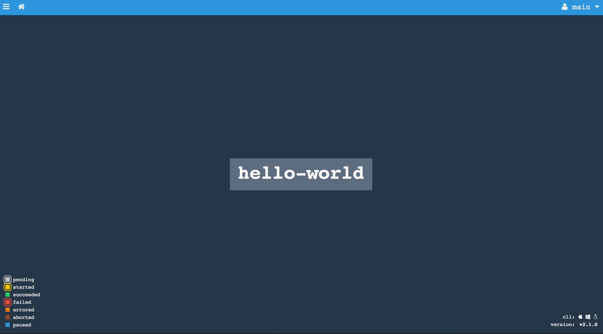

footer: © 2016 Matt Stine
slidenumbers: true
autoscale: true

# [fit] Concourse:
# [fit] CI that scales with your project


---


# Me

Matt Stine [@mstine](http://twitter.com/mstine)
Strategic Product Owner - Spring Portfolio
Pivotal Software, Inc.
[matt.stine@gmail.com](mailto:matt.stine@gmail.com)

---


# I wrote a little cloud book...

FREE - Compliments of Pivotal

[http://bit.ly/cloud-native-book](http://bit.ly/cloud-native-book)

---

# What is Concourse?

- Open Source CI Pipeline system
- Developed by Pivotal
- [http://concourse.ci](http://concourse.ci)

---

# Because the world needed another CI system...
# [fit] 0_o

---

# [fit] Why?


---

# [fit] Simplicity

^ - shouldn't have to know the guts
- should be able to learn in one sitting
- 3 primitives - tasks/resources/jobs - allow the expression of arbitrary features and pipelines

---

# [fit] Usability

^ - UI optimized for get me where I want to go as fast as possible

---

# [fit] Build Isolation


^ - death to build pollution!
- builds run in containers
- everyone can share workers and never worry about cross-contamination

---

# [fit] Scalable/Reproducible deployment


http://bosh.io

^ - no snowflakes!
- statically configured -  can always be recreated from scratch with a single BOSH deploy
- If your deployment's infrastructure burns down, just deploy it somewhere else.
- scale up/down by bumping a number in your BOSH manifest

---

# [fit] Flexibility

^ - almost nothing supported in the core (the anti-Jenkins)
- integrations with other things implemented using resource abstraction

---

# [fit] _Local_
# [fit] Iteration

^ - run concourse locally
- yak shave tasks using local execution and the fly CLI
- have confidence that local builds are identical to remote builds
- keep your commit history clean of junk

---

# [fit] Concepts


---

# Running Example:

- Consumer-Driven Contract Testing ([http://martinfowler.com/articles/consumerDrivenContracts.html](http://martinfowler.com/articles/consumerDrivenContracts.html))
- Using Pact-JVM ([https://github.com/DiUS/pact-jvm](https://github.com/DiUS/pact-jvm))
- Example Project ([https://github.com/mstine/microservices-pact](https://github.com/mstine/microservices-pact))

---

# [fit] Tasks
# [fit] _execution of a script in an isolated environment with dependent resources made available to it_

---

```
---
platform: linux
image: docker:///java#8
inputs:
- name: microservices-pact
- name: foo-consumer-version
outputs:
- name: pacts
- name: libs
params:
    TERM: dumb
    VERSION_FILE_PATH: foo-consumer-version
run:
  path: microservices-pact/gradlew
  args:
  - -b
  - microservices-pact/build.gradle
  - :microservices-pact-consumer:test
  - :microservices-pact-consumer:assemble
```

^ - platform
- docker image
- inputs placed at a path in the running containers
- parameters -> environment variables
- run stuff!

---

```
platform: linux
image: docker:///java#8
inputs:
- name: microservices-pact
- name: pact
- name: foo-provider-version
outputs:
- name: provider-libs
params:
  TERM: dumb
  PACT_FILE: ../pact/Foo_Consumer-Foo_Provider.json
  VERSION_FILE_PATH: foo-provider-version
run:
   path: microservices-pact/gradlew
   args:
   - -b
   - microservices-pact/build.gradle
   - :microservices-pact-provider:assemble
   - :microservices-pact-provider:pactVerify
```

---

# [fit] Resources
# [fit] _data: inputs/outputs_

---

# Can be...

- Checked
- Fetched
- Pushed

---

# Git

```
- name: microservices-pact
  type: git
  source:
    uri: https://github.com/mstine/microservices-pact.git
    branch: master
```

---

# S3 Bucket

```
- name: foo-consumer
  type: s3
  source:
    access_key_id: {{access_key_id}}
    secret_access_key: {{secret_access_key}}
    bucket: concourse-pact
    regexp: microservices-pact-consumer-(.*).jar$
```

---

# Semantic Versioning

```
- name: foo-consumer-version
  type: semver
  source:
    bucket: concourse-pact
    key: foo-consumer-version
    access_key_id: {{access_key_id}}
    secret_access_key: {{secret_access_key}}
    initial_version: 0.1.0
```

---

# Cloud Foundry!

```
- name: pws-deploy
  type: cf
  source:
    api: https://api.run.pivotal.io
    username: {{pws_username}}
    password: {{pws_password}}
    organization: platform-eng
    space: concourse-demo
    skip_cert_check: false
```

---

# Built-In Resources
## [http://concourse.ci/resource-types.html](http://concourse.ci/resource-types.html)

- The git resource can pull and push to git repositories.
- The time resource can start jobs on a schedule or timestamp outputs.
- The s3 resource can fetch from and upload to S3 buckets.
- The archive resource can fetch and extract .tar.gz archives.
- The semver resource can set or bump version numbers.
- The github-release resource can fetch and publish versioned GitHub resources.
- The docker-image resource can fetch, build, and push Docker images
- The tracker resource can deliver stories and bugs on Pivotal Tracker
- The pool resource allows you to configure how to serialize use of an external system. This lets you prevent test interference or overwork on shared systems.
- The cf resource can deploy an application to Cloud Foundry.
- The bosh-io-release resource can track and fetch new BOSH releases from bosh.io.
- The bosh-io-stemcell resource can track and fetch new BOSH stemcells from bosh.io.
- The bosh-deployment resource can deploy BOSH stemcells and releases.
- The vagrant-cloud resource can fetch and publish Vagrant boxes to Atlas.

---

# Growing List of Community Resources, including:
## [http://concourse.ci/resource-types.html](http://concourse.ci/resource-types.html)

- Slack
- Pull Requests
- Email
- Bintray
- Perforce
- FTP
- Twitter
- HipChat
- Bitbucket
- Terraform
- Rsync
- JIRA
- Google Drive

---

# [fit] Implement Your Own

- Docker Image w/ 3 Scripts
- `/opt/resource/check`
- `/opt/resource/in`
- `/opt/resource/out`
- Add to your Concourse deploy via `resource_types` section in pipeline config:

```
resource_types:
- name: pivnet
  type: docker-image
  source:
    repository: pivotalcf/pivnet-resource
    tag: latest-final
```

- [http://concourse.ci/implementing-resources.html](http://concourse.ci/implementing-resources.html)

---

# [fit] Jobs
# [fit] _functions composed of behavior (tasks) and inputs/outputs (resources/other jobs)_

---

# Jobs Have Builds

- Success (all tasks succeed)
- Failure (any task fails)
- Can be accessed while running/shortly after finish (intercept/hijack)

---

# Jobs Have Plans

- Sequence of steps to execute:
- _get_ resources
- run things (_task_)
- _put_ resources
- parallel or serial

---

# Verify Pact (inputs)

```
- get: microservices-pact
  passed: [generate-pact]
  trigger: true
- get: foo-provider-version
  params: {bump: minor, pre: alpha}
- get: pact
  passed: [generate-pact]
  trigger: true
```

^ - passed - only run things that have passed upstream build
- trigger - new versions of resource should kick this build
- bumping versions

---

# Verify Pact (function)

```
- task: verify-pact
  file: microservices-pact/microservices-pact-provider/task.yml
```

^ CI config side-by-side with project!

---

# Verify Pact (task)

```
platform: linux
image: docker:///java#8
inputs:
- name: microservices-pact
- name: pact
- name: foo-provider-version
outputs:
- name: provider-libs
params:
  TERM: dumb
  PACT_FILE: ../pact/Foo_Consumer-Foo_Provider.json
  VERSION_FILE_PATH: foo-provider-version
run:
   path: microservices-pact/gradlew
   args:
   - -b
   - microservices-pact/build.gradle
   - :microservices-pact-provider:assemble
   - :microservices-pact-provider:pactVerify
```

---

# Verify Pact (outputs)

```
- put: foo-provider
  params: {file: provider-libs/microservices-pact-provider-*.jar}
- put: foo-provider-version
  params: {file: foo-provider-version/number}
```

---

# [fit] Pipelines


---


---

# [fit] That's
# [fit] It


---

# [fit] Learning to Fly


---

# Getting Started

```
$ vagrant init concourse/lite
$ vagrant up
```

---

# http://192.168.100.4:8080


---

# Let's do this...

```
jobs:
- name: hello-world
  plan:
  - task: say-hello
    config:
      platform: linux
      image_resource:
        type: docker-image
        source:
          repository: busybox
      run:
        path: echo
        args: ["Hello, World!"]
```

---

# Ship It!

```
$ fly set-pipeline -p hello-world -c hello-world-pipeline.yml
```

---



---


---

# [fit] Let's Play


^ Demonstrate loading the pipeline
Demonstrate modifying the pipeline
Demonstrate intercepting the container
Poke around with the BOSH deployment, scale up/down workers
Examine resource types in the pipeline
Examine job types in the pipeline
Kick off builds by pushing code to github
Demonstrate intercepting the container
Pipeline examples: SCS, Concourse itself

---

# Intercepting with Fly

Intercepting a Job Step
```
fly -t <target> intercept -j <pipeline>/<job> -b <build #> -s <step>
```

Intercepting a Resource
```
fly -t <target> intercept --check <pipeline>/<resource> /bin/sh
```

---

# Thanks!

_Matt Stine_ ([@mstine](http://twitter.com/mstine))

* _This Presentation:_ [https://github.com/mstine/nfjs_2015/tree/master/Concourse](https://github.com/mstine/nfjs_2015/tree/master/Concourse)
* _Example Project:_ [https://github.com/mstine/microservices-pact](https://github.com/mstine/microservices-pact)
* _Concourse Website:_ [http://concourse.ci](http://concourse.ci)
* _Concourse Slack Team:_ [https://concourseci.slack.com](https://concourseci.slack.com)
